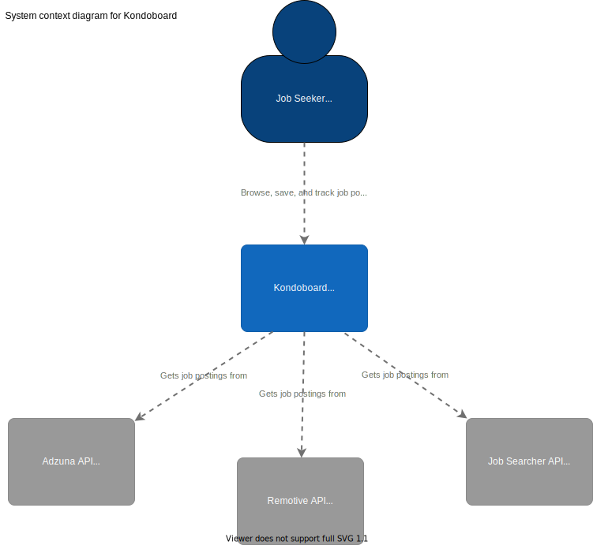
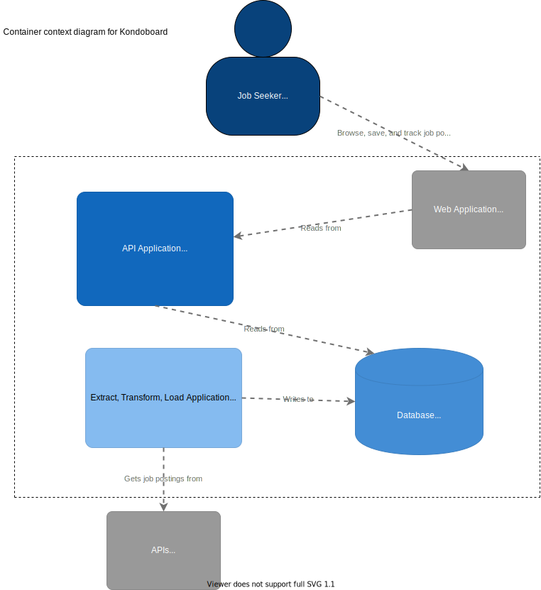

# kondoboard-ds

This repo contains the FastAPI application for Kondoboard, a platform that allows Lambda School students to browse, save, and track job postings during the job hunt. 

## Table of Contents
- [Background](#background)
- [Diagrams](#diagrams)
- [Install](#install) 
- [Usage](#usage)
- [Testing](#testing)
- [License](#license)
- [Instructions-M](#instructions-m)

## Background

## Diagrams
We created C4 diagrams to communicate the software architecture

### Context

### Container

## Install
``

## Usage
``

## Testing
``

## License

## Instructions-M
``

- Don't try to run docker container inside a conda environment. Might be obvious why not to some people, it gave me issues. Virtual environment inside a virtual environment inception nightmare. 

- FastApi does not have a built in ASGI server like Flask or Django
    - We will be using Uvicorn as the ASGI 
    - New to ASGI? Read through the excellent Introduction to ASGI: Emergence of an Async Python Web Ecosystem blog post. https://florimond.dev/blog/articles/2019/08/introduction-to-asgi-async-python-web/

- Built with FastApi 0.46.0
- Built with FastAPI 0.11.1

- Docker Image 3.7-slim-buster 

Reasons:
as of April 2020, Debian Buster is a good operating system base:

1. It’s more up-to-date than ubuntu:18.04.
2. ubuntu:20.04 will take the lead in terms of packages being up-to-date, and it’s a Long Term Support release, so it’s a good choice too once it’s released in April 2020. It will limit you to Python 3.8 only, however, without doing a bit more work. Also, as with any new major software release, it’s probably worth waiting a month or three after its initial release for all the bugs to be fixed.
3. It’s stable, and won’t have significant library changes.
4. There’s less chances of weird production bugs than Alpine.

We started with an Debian Buster based Docker image for Python 3.7 We then set a working directory along with two environment variables:

PYTHONDONTWRITEBYTECODE: Prevents Python from writing pyc files to disc (equivalent to python -B option)
PYTHONUNBUFFERED: Prevents Python from buffering stdout and stderr (equivalent to python -u option)
