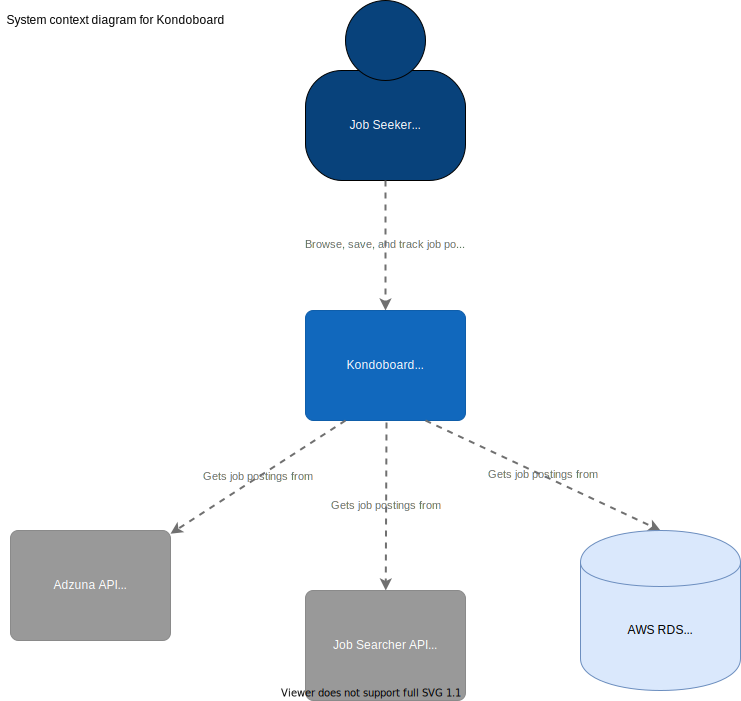
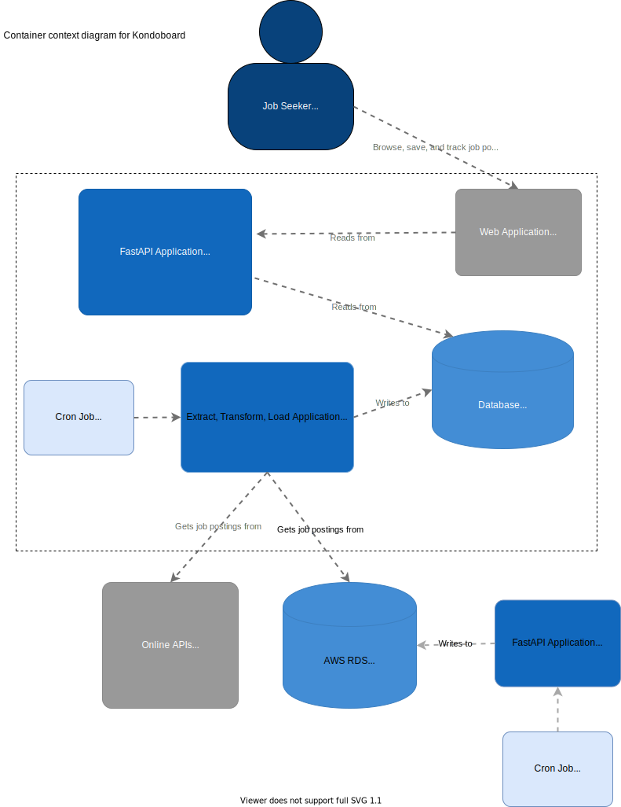

# kondoboard-ds

This repo contains the FastAPI application for Kondoboard, a platform that allows Lambda School students to browse, save, and track job postings during the job hunt. 

## Table of Contents
- [Background](#background)
- [Diagrams](#diagrams)
- [Install](#install) 
- [Usage](#usage)
- [Testing](#testing)
- [License](#license)
- [Instructions-M](#instructions-m)

## Background

## Diagrams
We created C4 diagrams to communicate the software architecture

### Context

### Container

## Install
``

## Usage
``

## Testing
``

## License

## Instructions-M
``

- Don't try to run docker container inside a conda environment. Might be obvious why not to some people, it gave me issues. Virtual environment inside a virtual environment inception nightmare. 

#TODO remove this note to self about requirements txt file 
fastapi==0.46.0
uvicorn==0.11.1

# dev
pytest==5.3.2
requests==2.22.0